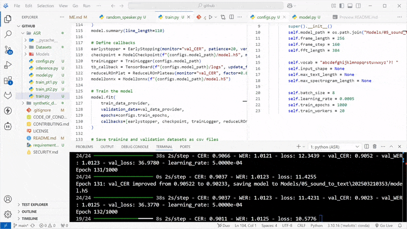
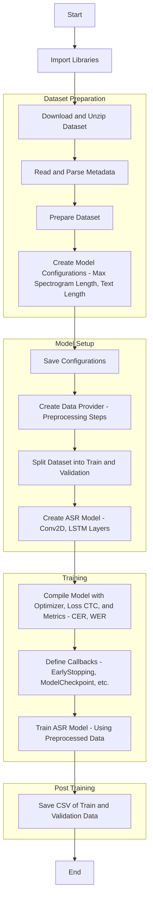

# ASR ML Model for the Automotive Industry
## Overview
This is a machine learning model designed to recognize spoken terms with various English accents within the automotive industry, developed from scratch.

<div align="center">

<p>Training the model</p>
</div>

## 1. Synthetic Data creation
> First of all, why even using synthetic data? <br>Because I don't have available true samples :D

Go to the directory `syntehtic_data` and follow the steps below:
```sh
cd synthetic_data
```
### 1.1. Tools
- MeloTTS
- PyTorch
- NLTK
- TensorFlow

### 1.2. Setup
- Requirements
    - conda `>= 24.9.1`
    - python `>= 3.10`

- Create a conda environment and activate it
```sh
conda melotts
conda activate melotts
```

- Install pytorch
```sh
pip3 install torch torchvision torchaudio --index-url https://download.pytorch.org/whl/cu118
```

- Install MeloTTS
```sh
git clone https://github.com/myshell-ai/MeloTTS.git
cd MeloTTS
conda create -n melotts python=3.10
pip install -e .
python -m unidic download
```

- Install NLTK
```sh
pip install nltk
```

>**Possible errors with nltk and solution:**
- Create a folder called `nltk_data` inside the `synthetic_data\MeloTTS` directory
    ```
    import nltk
    nltk.download('punkt')  # Downloads the tokenizer models
    nltk.download('averaged_perceptron_tagger')  # Downloads the POS tagger
    nltk.download('stopwords')  # Downloads the stop words corpus
    nltk.download('wordnet')  # Downloads the WordNet corpus
    nltk.data.path.append(r'path_to_nltk_data') # Add the path of the folder nltk_data
    ```

- Error with importing nltk and `averaged_perceptron_tagger_eng`:
    - Open a python shell and do:
    ```python
    import nltk
    nltk.download('averaged_perceptron_tagger_eng')
    exit()
    ```

### 1.3. Steps

#### 1.3.1. Running a simple test
Create a unique WAV file, `output.wav`, to verify that everything is working correctly by running:

```sh
python single_output.py
```

#### 1.3.2. Create wav files from `metadata.csv`
Run the following command to create wav files from the csv file `metadada`. It will also store them in a folder `wavs`

```sh
python random_speaker.py
```

The wav files will be random speakers saying words within `metadata.csv` and they will be speaking with on of these accents:
```
speaker_ids = {'EN-US': 0, 'EN-BR': 1, 'EN_INDIA': 2, 'EN-AU': 3, 'EN-Default': 4}
```
These words comprise car manufacturers<sup>[2]</sup> and a glossary of automotive terms<sup>[3,4,5]</sup>.

> A wide range of automotive terms and car manufacturers can be found at `synthetic_data/data` (~1000 terms and ~500 car manufacturers)

## 2. Phases

### 2.1 Dataset Preparation:

- Creating the dataset: Move the `wavs` folder located in `synthethic_data` to `ASR/Datasets/LJSpeech-1.1` and the file metadata.csv to the same place.
- Parse Metadata: The dataset's metadata is read, which contains the mapping of audio file names to their transcriptions.
- Prepare Dataset: It creates a dataset where each entry consists of the path to the audio file and its corresponding transcription. The transcription is also normalized (converted to lowercase).

### 2.2. Model Configuration:

- Spectrogram Extraction: For each audio file, a spectrogram is generated. A spectrogram represents the audio in a time-frequency domain, which is useful for speech recognition models.
- Compute Maximum Lengths: The maximum lengths of the spectrograms (time dimension) and transcriptions (text dimension) are computed to ensure consistent input size for the neural network.
- Save Configurations: These computed configurations (like max lengths and input shapes) are saved to ensure they can be used later during training.

### 2.3. Data Preprocessing:

- The dataset is transformed with preprocessing steps that:
    - Convert the audio files into spectrograms.
    - Convert the transcriptions into numerical labels using a vocabulary (for use with the CTC loss).
    - Pad both spectrograms and transcriptions to their maximum lengths to ensure consistent batch processing.

### 2.4. Model Creation:

- The model is a combination of convolutional and recurrent layers:
    - Convolutional Layers: These layers help extract features from the spectrograms.
    - Bidirectional LSTM (Long Short-Term Memory) Layers: These layers learn to model the sequential dependencies in the speech data, which is crucial for ASR.
    - Dense Layer: This layer is used to map the learned features to the output space (the vocabulary).
    - Softmax Output: This layer produces the probability distribution over the vocabulary for each time step in the sequence.

### 2.5. Model Training:

- The model is compiled using an Adam optimizer and the CTC loss function, which is commonly used in ASR tasks.
- Custom metrics like CER (Character Error Rate) and WER (Word Error Rate) are used to monitor the performance during training.
- Several callbacks are set up, such as early stopping, model checkpointing, learning rate reduction, and TensorBoard for logging.
- The model is then trained on the preprocessed dataset.

    To train go to the folder `ASR` and run:
    ```sh
    python train.py
    ```

### 2.6. Post-Training:

- After training, the training and validation datasets are saved as CSV files for further inspection or usage.

## 3. But how this thing works?
- **Input**: The input to the model is an audio file that is converted into a spectrogram (a 2D representation of the audio signal).
- **Output**: The output of the model is a transcription (the text corresponding to the spoken words in the audio).
- **CTC Loss**: The Connectionist Temporal Classification (CTC) loss function is used to handle the alignment between the audio sequence and the transcription, which is particularly useful in speech recognition when the alignment is not explicitly known.

<div align=center>



</div>

## 4. References
[[1]](https://huggingface.co/myshell-ai/MeloTTS-English) Zhao, W., Yu, X., & Qin, Z. (2023). *MeloTTS: High-quality Multi-lingual Multi-accent Text-to-Speech*<br>
[[2]](https://www.supercars.net/blog/all-brands/) A List of Every Car Brand, Manufacturer & Aftermarket Tuner<br>
[[3]](https://www.caranddriver.com/features/a16581035/car-terms-defined/) Glossary of Terms - Car terms: defined! (data/output_1.txt)<br>
[[4]](https://en.wikipedia.org/wiki/Glossary_of_automotive_terms) Glossary of automotive terms (data/output_2.txt)<br>
[[5]](https://www.edmunds.com/glossary/) Alphabetical Glossary of Automotive Terms (data/output_3.txt)<br>

## 5. TO-DO
- [X] `► Script that generates a wav file of a chosen  English accent`
- [X] `► Generalized script that creates 1000's of wav files with different English accents`
- [X] `► Script to train an ASR`
- [X] `► Prepare a Script for Data labeling`
- [X] `► Inference Script for model deploying/serving`
- [ ] `► Fix abreviations in wav files, i.e. BMW`
- [ ] `► More to come ...`

